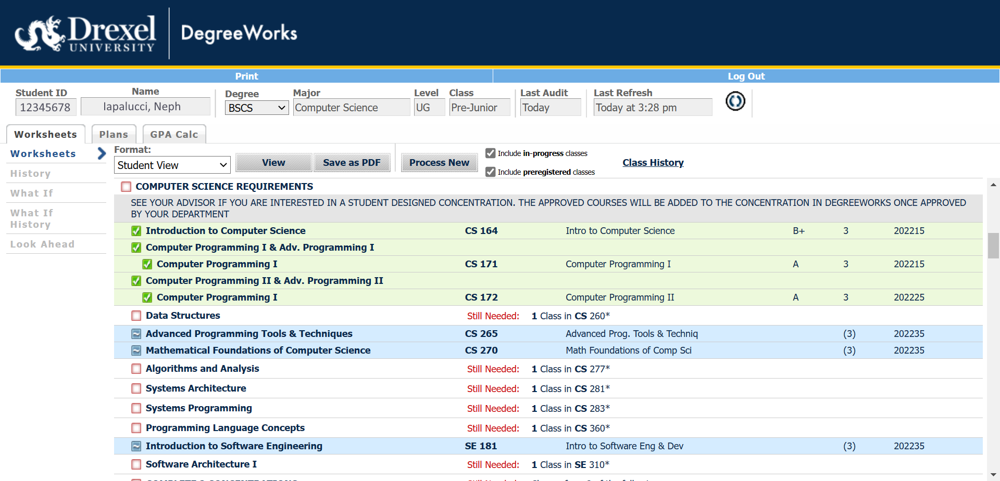
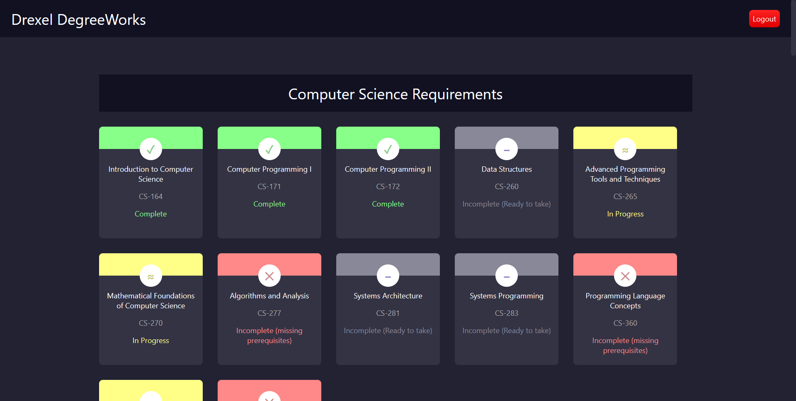

# better-drexel-web

`better-drexel-web` is a Chrome extension for improving the look and feel of Drexel websites into something a little more mordern.

## Pages

The `better-drexel-web` extension currently provides alternatives for all of the following Drexel pages, any of which may be disabed individually:

### DegreeWorks
Before: 
After: 

## Roadmap

`better-drexel-web` currently has the following roadmap of features:

- [x] Support for DegreeWorks page
- [ ] Support for Drexel One page
- [ ] Support for Banner pages
- [ ] Support for Drexel Learn (Blackboard) pages
- [ ] Theme selection
- [ ] Custom themes

## Developer Testing
`better-drexel-web` currently isn't released on the Chrome web store as it's still in early development. To test it and report bugs, clone the repository and build it with `npm run build`, then load it into any Chromium based browser as an unpacked extension. 